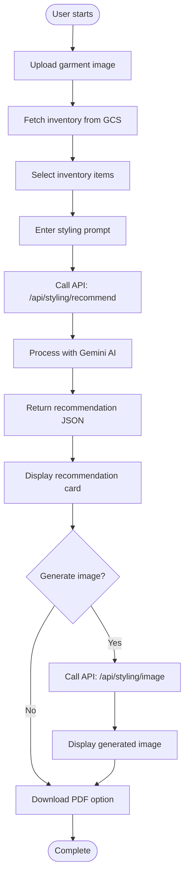

<div align="center">

</div>

# AI Fashion Stylist

An intelligent fashion styling application powered by Google's Gemini AI. Create complete outfit recommendations from your wardrobe inventory or transform old clothing into sustainable tote bag designs.

View your app in AI Studio: https://ai.studio/apps/drive/1YkCBkQl10UJdGrg5PTlrr0HW8Z0nJ1ha

## Features

### 🎨 Styling Assistant
- Upload a garment image and describe an occasion
- Get AI-powered outfit recommendations from your inventory
- Generate complete looks with accessories and color palette suggestions
- Download outfit recommendations as PDFs

### ♻️ Sustainability Designer
- Upload old clothing items to transform into tote bag designs
- Automatic material detection and design generation
- Incorporate visual elements from your clothing into unique bag designs
- Generate visual representations of the proposed tote bags

## Tech Stack

- **Framework**: Next.js 15.2.4 (App Router)
- **React**: 19.0.0
- **Language**: TypeScript 5
- **AI**: Google Gemini AI (gemini-2.5-flash)
- **Styling**: Tailwind CSS 4
- **UI Components**: Radix UI primitives
- **State Management**: TanStack React Query
- **Cloud Storage**: Google Cloud Storage (GCS)
- **PDF Generation**: jsPDF
- **Icons**: Lucide React

## Architecture

### System Architecture Diagram


### Data Flow Diagram


### Component Interaction Diagram


### Styling Feature Flow



### Sustainability Feature Flow


## Project Structure

```
ai-fashion-stylist/
├── app/                          # Next.js App Router
│   ├── api/                      # API routes
│   │   ├── inventory/            # Inventory management endpoint
│   │   │   └── route.ts          # GET inventory from GCS
│   │   ├── styling/              # Styling features
│   │   │   ├── recommend/        # Outfit recommendation endpoint
│   │   │   │   └── route.ts      # POST outfit recommendations
│   │   │   └── image/            # Outfit image generation
│   │   └── sustainability/       # Sustainability features
│   │       ├── design/           # Tote bag design endpoint
│   │       └── image/            # Tote bag image generation
│   ├── layout.tsx                # Root layout
│   ├── page.tsx                  # Home page
│   └── globals.css               # Global styles
├── components/                   # React components
│   ├── ui/                       # Reusable UI components (Radix UI)
│   ├── Card.tsx                  # Card component for displaying recommendations
│   ├── Home.tsx                  # Main home component with tabs
│   ├── Styling.tsx               # Styling feature component
│   ├── Sustainability.tsx        # Sustainability feature component
│   └── Tabs.tsx                  # Tab navigation component
├── services/                     # Service layer
│   ├── geminiService.ts          # Gemini AI service for styling
│   ├── gcsInventoryService.ts    # Google Cloud Storage inventory service
│   └── sustainabilityService.ts  # Sustainability/tote bag service
├── lib/                          # Core libraries
│   └── ai.ts                     # AI configuration and schemas
├── utils/                        # Utility functions
│   └── downloadUtils.ts          # Download helpers (PDF, images)
├── types.ts                      # TypeScript type definitions
├── Dockerfile                    # Docker configuration for deployment
├── cloudbuild.yaml               # Google Cloud Build configuration
├── next.config.ts                # Next.js configuration
├── tsconfig.json                 # TypeScript configuration
├── package.json                  # Dependencies and scripts
└── inventory.example.json        # Example inventory file format
```

## Getting Started

### Prerequisites

- Node.js 20+ (recommended)
- npm or yarn
- Google Cloud Storage bucket (for inventory storage)
- Gemini API key

### Installation

1. **Clone the repository**:
   ```bash
   git clone <repository-url>
   cd ai-fashion-stylist
   ```

2. **Install dependencies**:
   ```bash
   npm install
   ```

3. **Set up environment variables**:
   
   Create a `.env.local` file in the root directory:
   ```env
   GEMINI_API_KEY=your_gemini_api_key_here
   GCS_BUCKET_NAME=your-bucket-name
   GCS_INVENTORY_PATH=path/to/inventory.json  # Optional
   ```

4. **Set up inventory** (choose one method):

   **Option A - Automatic Discovery**:
   - Ensure your GCS bucket is public
   - Upload image files directly to the bucket root
   - Supported formats: jpg, jpeg, png, webp, gif, svg
   - The app will automatically discover and list all image files

   **Option B - Metadata File**:
   - Create an `inventory.json` file in your GCS bucket
   - See `inventory.example.json` for the format
   - Set `GCS_INVENTORY_PATH` environment variable to the file path

5. **Run the development server**:
   ```bash
   npm run dev
   ```

6. **Open your browser**:
   Navigate to [http://localhost:3000](http://localhost:3000)

## Available Scripts

- `npm run dev` - Start development server with Turbopack
- `npm run build` - Build the application for production
- `npm run start` - Start production server
- `npm run lint` - Run ESLint

## Deployment

### Docker

The project includes a Dockerfile for containerized deployment:

```bash
docker build -t ai-fashion-stylist .
docker run -p 3000:8080 ai-fashion-stylist
```

### Google Cloud Build

The `cloudbuild.yaml` file is configured for Google Cloud Build deployment. Ensure your environment variables are set in your Cloud Build configuration.

## API Endpoints

### `/api/inventory` (GET)
Fetches inventory items from Google Cloud Storage. Returns an array of inventory items with `id`, `src`, and `alt` properties.

### `/api/styling/recommend` (POST)
Generates outfit recommendations based on user's garment and inventory items.

**Request Body**:
```json
{
  "prompt": "casual weekend brunch",
  "userImage": { "base64": "...", "mimeType": "image/jpeg" },
  "inventoryImages": [
    { "base64": "...", "mimeType": "image/jpeg" }
  ]
}
```

### `/api/sustainability/design` (POST)
Generates tote bag design recommendations from uploaded clothing items.

**Request Body**:
```json
{
  "userImages": [
    { "base64": "...", "mimeType": "image/jpeg" }
  ],
  "additionalMaterial": "plain" // Optional
}
```

## Key Features Implementation

### Styling System
- Uses Gemini 2.5 Flash model for outfit recommendations
- Analyzes user's garment and inventory items
- Generates structured JSON responses with title, justification, accessories, color palette, and image description
- Supports image generation for visual outfit representations

### Sustainability System
- Transforms old clothing into tote bag designs
- Automatically detects material types from images
- Preserves visual elements (patterns, textures, seams) from original clothing
- Generates detailed design specifications and visual representations

## Environment Variables

| Variable | Description | Required | Default |
|----------|-------------|----------|---------|
| `GEMINI_API_KEY` | Your Google Gemini API key | Yes | - |
| `GCS_BUCKET_NAME` | Google Cloud Storage bucket name | Yes | `maker-suite-images` |
| `GCS_INVENTORY_PATH` | Path to inventory JSON file in GCS | No | - |
| `NEXT_PUBLIC_BASE_PATH` | Base path for public assets | No | - |

## License

This project is private and proprietary.

## Support

For issues or questions, please refer to the AI Studio link above or contact the development team.
